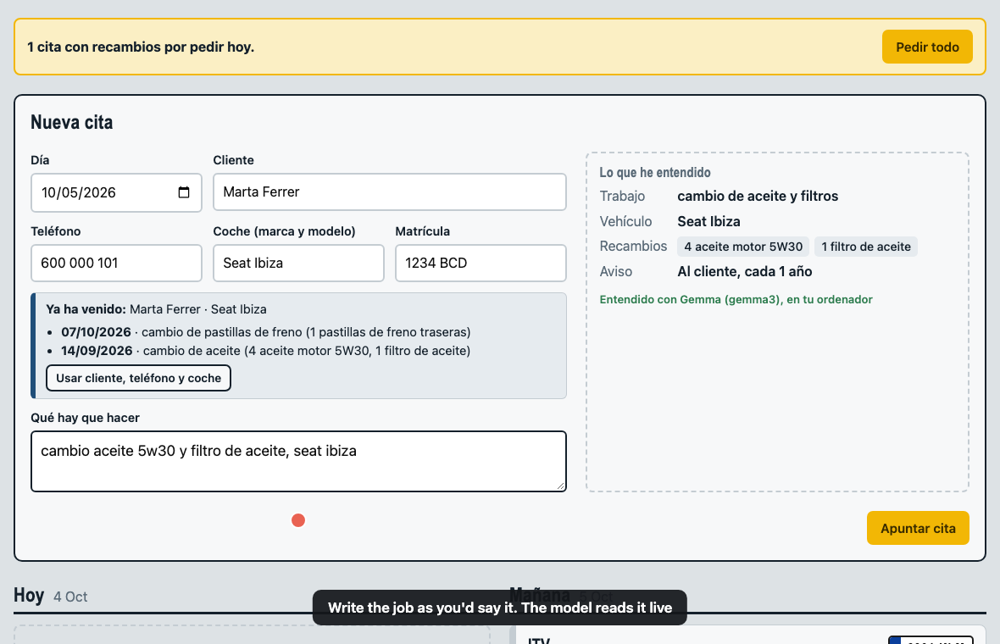
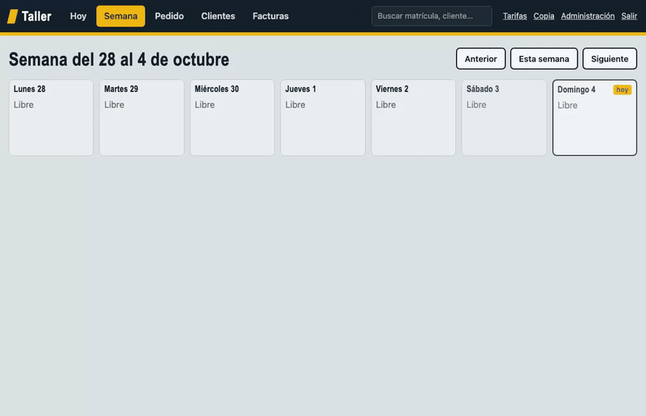
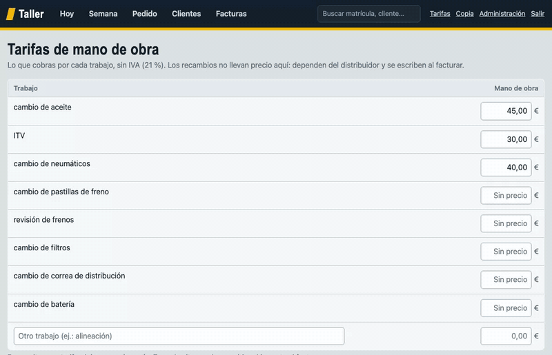

# Gemma Garage


*A local-first appointment book for a car workshop. A local Gemma model reads the mechanic's notes and does the paperwork.*

Built for a mechanic who keeps his jobs as scribbles and loses evenings phoning parts distributors and chasing customers:

1. **You write the job as on paper**: `cambio aceite motor opel aceite 5w30`.
2. An **open-weight model running locally** (Gemma, through Ollama) understands the note: job, car, parts and how often it repeats.
3. **The business day before the appointment, the parts are ordered** from the distributor (Monday for Tuesday; Friday for Monday).
4. If the job repeats (ITV, oil: every 12 months), **the customer gets a Telegram reminder** a week before the year is up.
5. When the job is done, a printable **invoice with VAT** is generated.

It has its own **web front end** (*Today*, *Week*, *Customers* and *Invoices* screens, also on the phone) and, for the advanced bits, the **Django admin** at `/admin/`. Database: **Postgres** (SQLite fallback). The interface is in Spanish, because that is what the mechanic reads.

No cloud AI: customer names, plates and phone numbers never leave the machine. If no model is running, simple rules take over for the common jobs, so the workshop never stops.

## What it looks like

Full video: [`docs/media/taller-demo.mp4`](docs/media/taller-demo.mp4). All screenshots use sample data (made-up customers and plates).

**1. New appointment.** Type a plate and it recognises the returning customer; write the note the way you'd say it and the *Lo que he entendido* ("what I understood") panel shows the job, the car, the parts and the yearly reminder.


With Gemma running, the panel says so (this is a real capture, `gemma3` running locally):



**2. Review and order the parts**, with a "Pidiendo recambios…" (ordering parts) spinner while it goes out. If the distributor fails, the appointment is flagged so you can retry.


**3. Shopping list for the day**


**4. Done → invoice.** Type the part prices from the delivery note (they are never stored: they depend on the distributor); labour comes from your tariffs; the total updates live.



**5. Tariffs, week, search and customers**



**6. On the phone**


> The screenshots and GIFs are generated by `docs/record_demo.py`. With Ollama running, the panel is green (Gemma); without it, grey (simple rules). The script records what it sees and retouches nothing.

## Try it with sample data

```bash
python manage.py demo            # only if the database is empty
python manage.py demo --reset    # wipes customers, appointments and invoices (saves a .json backup first)
```

To regenerate the screenshots and videos with Gemma (Ollama running, virtualenv active; needs `ffmpeg`):

```bash
bash docs/grabar.sh
```

It loads the sample data (backing up yours first), starts the server by itself, records and stops it. If Gemma doesn't answer it stops instead of recording with the simple rules (`ALLOW_RULES=1` forces it).

## Getting started

You need: **Python 3.10+**, **Git** and **Docker** (for Postgres). Ollama is optional.

**1. Clone the project**

```bash
git clone https://github.com/antoniahp/gemma-garage.git
cd gemma-garage
```

**2. Create a virtualenv and install the dependencies**

```bash
python3 -m venv .venv
source .venv/bin/activate          # Windows: .venv\Scripts\activate
pip install -r requirements.txt
```

**3. Start Postgres**

```bash
docker compose up -d
```

**4. Load the configuration**

```bash
cp .env.example .env               # Windows: copy .env.example .env
set -a; source .env; set +a        # loads the variables in this terminal
```

On Windows (PowerShell), instead of the last line:

```powershell
Get-Content .env | Where-Object { $_ -match '^[A-Z]' } | ForEach-Object { $k,$v = $_ -split '=',2; Set-Item "env:$k" $v }
```

The variables only apply to the terminal where you load them: load them again in a new one.

**5. Create the tables and your user**

```bash
python manage.py migrate
python manage.py createsuperuser   # asks for a username and password
```

**6. (Optional) Load sample appointments**

```bash
python manage.py demo
```

**7. Open the app**

```bash
python manage.py runserver
```

Go to <http://127.0.0.1:8000> and sign in. You'll see the **Hoy** (today) board; *Nueva cita* at the top interprets what you type as you type it. Orders, reminders and other data are managed at <http://127.0.0.1:8000/admin/>.

**8. Add an appointment**

In **Hoy → Nueva cita**: pick the day, type the customer and the note (`cambio aceite motor opel aceite 5w30`). Next to it you see what was understood (job, parts, yearly reminder). New customers are created automatically; any value can be fixed in `/admin/`. If the job repeats, next year's reminder is already scheduled.

**9. Run the daily job**

```bash
python manage.py run_daily
```

It orders the parts for tomorrow's appointments and sends the reminders that are due. With nothing else configured, **nothing leaves the machine**: orders and reminders are written to the `outbox/` folder so you can check them. Each appointment card has *Pedir ahora* (order now) and *Hecha y facturar* (done and invoice) buttons.

**10. Schedule it every morning**

Linux/macOS (cron, 8:00 Monday to Friday; adjust paths):

```
0 8 * * 1-5  cd /path/gemma-garage && set -a && . ./.env && set +a && .venv/bin/python manage.py run_daily
```

Windows: Task Scheduler → run `.venv\Scripts\python.exe manage.py run_daily` in the project folder (with the variables defined). If a day is missed, the next run orders whatever is missing.

## Front-end conveniences

- **Order** (`/pedido/`): review and edit the parts (quantities, lines) before they go to the supplier. A failed order shows in red on *Hoy* so you can retry it.
- **Shopping list** (`/compra/`): every part for a day, summed and ready to print.
- **Edit appointment**: *Editar* button on each card. Changing the date or the repetition reschedules the yearly reminder.
- **History by plate**: typing a plate in *Nueva cita* shows previous visits and lets you reuse the customer.
- **Search** (top box): by plate, customer, phone, vehicle or note.
- **Call / WhatsApp**: links on each card and in *Clientes* (a 9-digit phone gets +34).
- **Tariffs** (`/tarifas/`): what you charge for labour per job (oil change €45, ITV €30…). Parts have no stored price, because they depend on the distributor: when you press *Hecha y facturar* you type each part's price from its delivery note, and labour comes pre-filled (you can change it for that appointment).
- **Backup** (top right): downloads all the data as a `.json` file. To restore it: `python manage.py loaddata copia-taller-YYYY-MM-DD.json` (into a freshly migrated database).

If you are upgrading from an earlier version, run `python manage.py migrate` (adds the last-order-error field and the labour tariffs).

## Telegram reminders (free)

A Telegram bot **cannot message a customer who has never talked to it**. So each customer has to open a link once.

1. In Telegram talk to **@BotFather**, send `/newbot` and follow the steps. It gives you a **token** and a username.
2. Fill `TELEGRAM_BOT_TOKEN` and `TELEGRAM_BOT_USERNAME` in `.env` and reload the variables.
3. Leave the bot listening in a separate terminal: `python manage.py telegram_bot`.
4. **Your mechanic chat:** send `/id` to your bot, copy the number into `TELEGRAM_OWNER_CHAT_ID` and reload. You get a daily summary and the reminders of customers without Telegram.
5. **Each customer:** open the **Clientes** screen, copy their **link** and send it to them (WhatsApp or printed). When they open it and press *Start*, they are linked.

If a customer is due a reminder and hasn't linked Telegram yet, the bot **sends it to you** with their phone number so you can call them.

## Parts supplier

By default it is a test supplier (`outbox/pedidos.jsonl`). With `TALLER_SUPPLIER=email` and the `SMTP_*` and `SUPPLIER_EMAIL` variables (see `.env.example`) it sends by email. Bosch, Lozano and other distributors don't usually offer a standard public API; ordering by email or through their portal is the norm. For a specific portal, add another `PartsSupplier` adapter in `taller/infrastructure/` (see Architecture).

## Local AI (optional but recommended)

Install [Ollama](https://ollama.com) and run `ollama pull gemma3`. With Ollama running, the app uses it automatically. Without it, it still works with rules for the usual jobs (oil, ITV, brakes, filters, tyres, battery, timing belt). Variables: `TALLER_MODEL`, `OLLAMA_URL`, and `TALLER_NO_LLM=1` to turn it off.

The model only interprets text. Dates, orders and money are plain code, and the panel always says which engine answered and why Gemma wasn't used (not running, timeout, bad output).

## Security

- Meant to run on the workshop's own computer. For a server reachable from the internet: `DJANGO_DEBUG=0`, a long random `DJANGO_SECRET_KEY`, HTTPS and `DJANGO_ALLOWED_HOSTS`.
- Customer data stays in your Postgres. With local Gemma, the notes never leave the machine.
- Check the labour rates in *Tarifas*; you type part prices when invoicing. The invoice is a printable draft and does not replace certified invoicing software.
- Back up the database.

## Architecture

The code follows a hexagonal (ports and adapters) layout under `taller/`:

```
taller/
  domain/          entities (Django models), ports (ABCs), criteria, exceptions, pure rules
  application/     one folder per use case: <name>_command.py / _query.py + its handler
  infrastructure/  adapters: DB repositories, Ollama + rules parsers, suppliers, notifiers, Telegram
  container.py     composition root: the only place that wires ports to adapters
  views.py, admin.py, forms.py, management/   thin entry points that call handlers
```

- **Ports** (`domain/ports`): `NoteParser`, `PartsSupplier`, `ClientNotifier`, plus one repository interface per aggregate.
- **Gemma is an adapter**: `OllamaNoteParser` is wrapped by `NoteParserWithFallback`, which falls back to `RulesNoteParser` and records why.
- **Add a supplier** (e.g. a distributor portal): implement `PartsSupplier.send_order()` in `taller/infrastructure/` and select it in `container.parts_supplier()`.
- **Tests** run use cases against in-memory fake ports (`taller/tests_application.py`), no database or network needed.

## Tests

```bash
python manage.py test taller
```

They run on Postgres (if the variables are loaded) or on SQLite.

## License

MIT.
